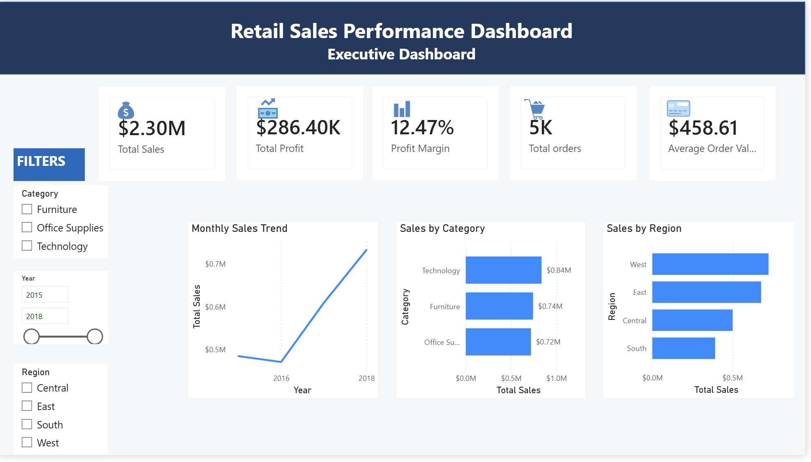
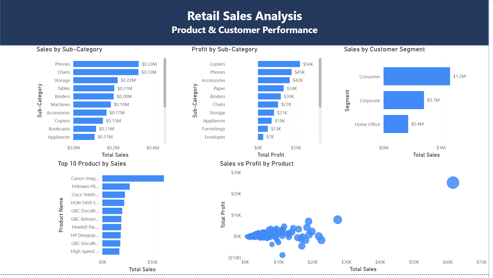
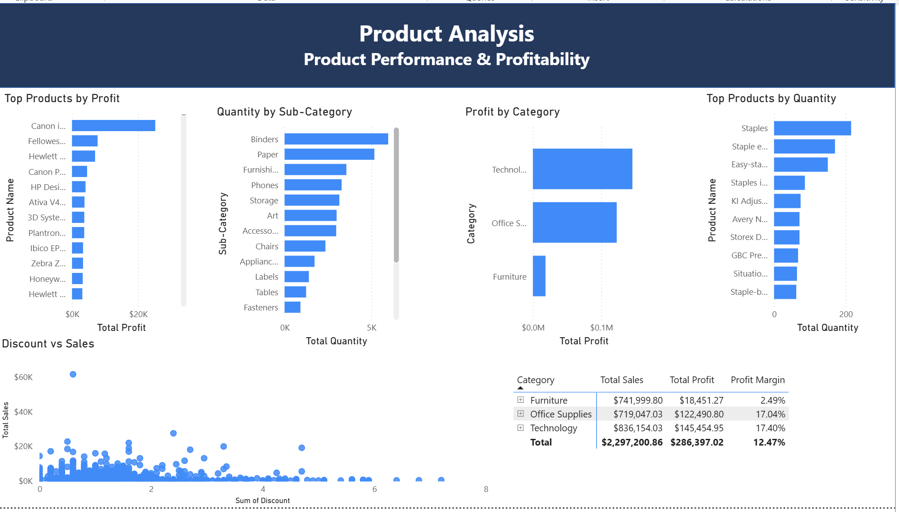
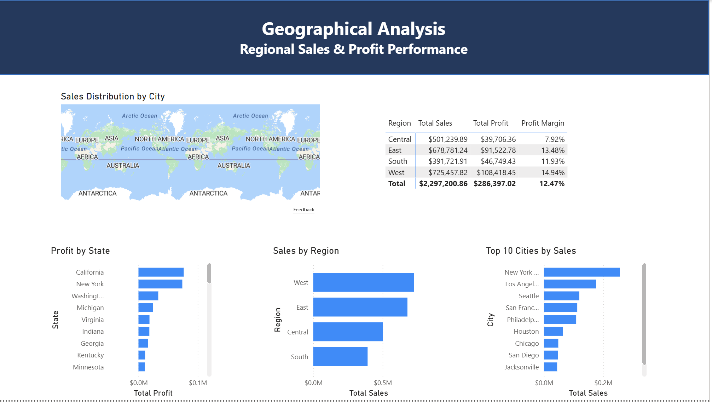

# PowerBI-Sales-Dashboard

## Overview

This project presents an interactive sales dashboard built with Microsoft Power BI to analyze business performance and support data-driven decision-making. The dashboard provides insights into sales, profit, orders, and customer trends through interactive visualizations.

## Objectives

* Analyze overall sales performance.
* Track profit and sales trends.
* Compare performance across different cities and product categories.
* Create interactive dashboards for business insights.

## Tools & Technologies

* Microsoft Power BI
* Microsoft Excel
* Power Query
* DAX (Data Analysis Expressions)

## Dashboard Features

* Total Sales KPI
* Total Profit KPI
* Total Orders KPI
* Sales Trend Analysis
* Category Performance
* City Performance
* Interactive Filters (Slicers)

## Project Files

* Power BI Report (.pbix)
* Dashboard Screenshots

## Screenshots

## Screenshots

## Key Skills Demonstrated

* Data Cleaning
* Data Modeling
* DAX Measures
* Data Visualization
* Dashboard Design
* Business Intelligence
* Data Analysis

## Author

**Hajar Aloufi**
